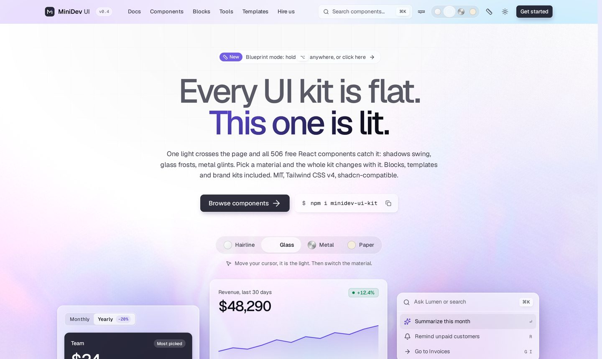

<div align="center">

# MiniDev UI

**500+ free React components, blocks and templates for real product screens.**<br/>
Tailwind CSS v4, Base UI, motion. shadcn-compatible. MIT.

[Website](https://ui.minidev.pro) · [Docs](https://ui.minidev.pro/docs) · [Components](https://ui.minidev.pro/components) · [Templates](https://ui.minidev.pro/templates) · [Free tools](https://ui.minidev.pro/tools) · [llms.txt](https://ui.minidev.pro/llms.txt)

[](https://www.npmjs.com/package/minidev-ui-kit)
[](./LICENSE)
[](https://ui.minidev.pro/docs/installation)

<picture>
  <source media="(prefers-color-scheme: dark)" srcset=".github/assets/hero-dark.jpg">
  
</picture>

</div>

## Why MiniDev UI

Most kits stop at buttons and cards. MiniDev UI covers the screens a product actually lives in after launch: data tables, billing and invoices, settings, dashboards, command palettes, notification centers and AI chat.

- **Product screens, not just primitives.** Multi select, date range picker, stepper, timeline, tree view, kanban, OTP input, phone input, signature pad, file dropzone and hundreds more.
- **Lit, not flat.** One light source crosses the page and every shadow follows it. Switch the whole kit between four materials (hairline, glass, metal, paper) with one attribute.
- **Accessible by default.** Built on [Base UI](https://base-ui.com) for focus, keyboard and ARIA. Every component works with the keyboard and with reduced motion.
- **You own the code.** Each component is one file that lands in your repo. No runtime lock-in.
- **Typed API reference** on every docs page, generated from the source.
- **Ready for AI agents.** [llms.txt](https://ui.minidev.pro/llms.txt) and [llms-full.txt](https://ui.minidev.pro/llms-full.txt) describe every component.

## Install

### One component with the shadcn CLI

```bash
npx shadcn@latest add https://ui.minidev.pro/r/multi-select.json
```

The source lands in `components/ui/`. Every component page shows its own command. Framework guides: [Next.js](https://ui.minidev.pro/docs/installation/nextjs), [Vite](https://ui.minidev.pro/docs/installation/vite), [React Router](https://ui.minidev.pro/docs/installation/react-router), [Astro](https://ui.minidev.pro/docs/installation/astro), [TanStack Start](https://ui.minidev.pro/docs/installation/tanstack-start).

### The whole kit from npm

```bash
npm i minidev-ui-kit @base-ui/react class-variance-authority clsx tailwind-merge lucide-react motion
```

```css
/* app/globals.css */
@import "tailwindcss";
@import "minidev-ui-kit/styles.css";
@source "../node_modules/minidev-ui-kit";
```

```tsx
import { Button } from "minidev-ui-kit/ui/button"
import { MultiSelect } from "minidev-ui-kit/ui/multi-select"
```

With Next.js, add `transpilePackages: ["minidev-ui-kit"]` to `next.config`.

## What's inside

| Category | Examples |
|---|---|
| [Forms](https://ui.minidev.pro/components/forms) | multi select, combobox, date range picker, OTP, masked input, floating label input, password strength, signature pad |
| [Data tables](https://ui.minidev.pro/components/data-tables) | sortable data table, row selection, pagination, column filters |
| [Charts](https://ui.minidev.pro/components/charts) | area, bar, pie, donut, radial, sparkline, chart cards |
| [Dashboard](https://ui.minidev.pro/components/dashboard) | event calendar, stat cards, activity feed, onboarding checklist |
| [Billing](https://ui.minidev.pro/components/billing) | pricing tables, credit card input, plan cards, invoices, usage meters |
| [Settings](https://ui.minidev.pro/components/settings) | profile, team, API keys, notifications, danger zone |
| [AI chat](https://ui.minidev.pro/components/ai-chat) | chat thread, prompt input, streaming message, model picker |
| [Navigation](https://ui.minidev.pro/components/navigation) | sidebar, command palette, tabs, breadcrumbs, stepper |
| [Feedback](https://ui.minidev.pro/components/feedback) | toast, notification center, empty states, skeletons |
| [Animation](https://ui.minidev.pro/components/animation) | meteors, particles, retro grid, ripple, shimmer button, border beam, dock, text reveal |
| [Media and dev tools](https://ui.minidev.pro/components/media) | image cropper, image gallery, file tree, code block, audio player |
| [Marketing](https://ui.minidev.pro/components/marketing) | heroes, feature grids, bento grid, testimonials, FAQ, CTA |

Plus [20 categories](https://ui.minidev.pro/components) in total, [8 full templates](https://ui.minidev.pro/templates) with brand kits, and [free design tools](https://ui.minidev.pro/tools) (shadcn theme generator, contrast checker, OKLCH palette, box shadow, mesh gradient).

## Run the site locally

```bash
npm install
npm run dev          # builds the registry, then starts Next.js on localhost:3000
```

Analytics are off unless you set env vars on your host. See `.env.example`.

```
src/registry/ui         components
src/registry/blocks     full-page compositions
src/registry/premium    motion components (free, like everything else)
src/styles/minidev.css  tokens, light, materials, motion
tools/build-registry.mjs   registry, docs index and llms.txt generator
DESIGN.md, docs/VISION.md  the design rules
```

## Contributing

Bug reports, component requests and pull requests are welcome. Read [CONTRIBUTING.md](./CONTRIBUTING.md) first.

## License

[MIT](./LICENSE). Free for personal and commercial projects, no attribution required.

---

Made by [MiniDev](https://minidev.pro), a studio that builds MVPs, apps and websites with this kit. Need the product, not just the parts? [Talk to us](https://ui.minidev.pro/studio).
